<div align="center">

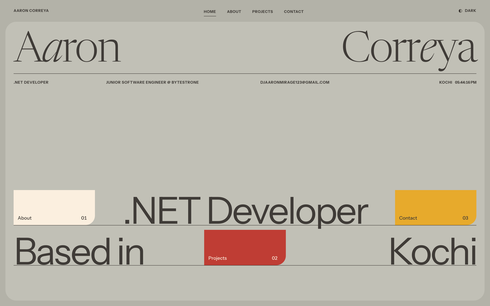

<br /><br />

# Spec-Driven Engineering meets a Kinetic Editorial Frontend

**Aaron Correya** · Junior Software Engineer (.NET) at Bytestrone · Kochi, India<br />
[djaaronmirage123@gmail.com](mailto:djaaronmirage123@gmail.com) · [github.com/AaronStark1](https://github.com/AaronStark1) · [linkedin.com/in/aaron-correya](https://www.linkedin.com/in/aaron-correya/) · [aaron-correya-portfolio.netlify.app](https://aaron-correya-portfolio.netlify.app/)

<br />

[](https://react.dev/)
[](https://vite.dev/)
[](https://tailwindcss.com/)
[](https://motion.dev/)
[](https://dotnet.microsoft.com/)

<br />

**[▶ Live Interactive Experience](https://aaron-correya-portfolio.netlify.app/)** &nbsp;·&nbsp;
**[💼 LinkedIn](https://www.linkedin.com/in/aaron-correya/)** &nbsp;·&nbsp;
**[📄 Resume](#)** <sub>TODO: add resume URL</sub>

</div>

<br />

> [!TIP]
> **Three-second version.** A .NET developer in Kochi who also cares about frontend craft. This is the portfolio site: every route is a physical *sheet* that lifts out as the next rises in, headlines are split into letters and raised from a mask, and there are two themes with one deliberate colour inversion and zero flash on load. Screenshots below, setup at the bottom.

<br />

## Scene 01 — Layered Sheet Architecture

<table>
  <tr>
    <td width="50%">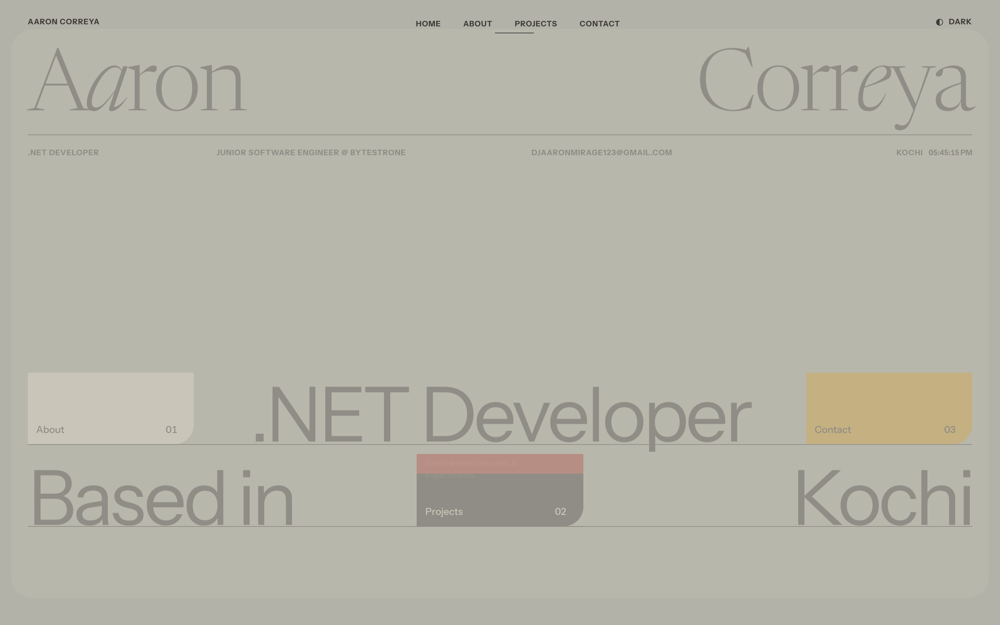</td>
    <td width="50%">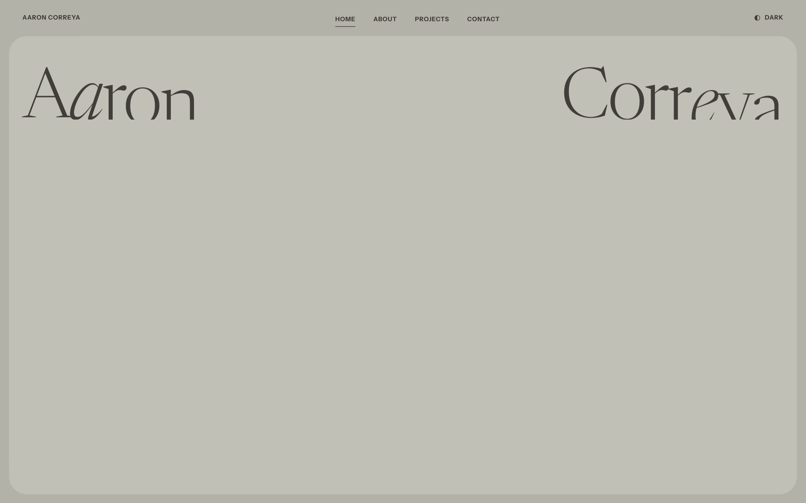</td>
  </tr>
  <tr>
    <td align="center"><sub>Outgoing sheet mid-exit after clicking <b>Projects</b></sub></td>
    <td align="center"><sub>Incoming title mid-rise on first paint</sub></td>
  </tr>
</table>

Every page renders inside one `Sheet` component: a rounded panel that enters with `opacity 0 → 1`, `y 48 → 0`, `scale 0.985 → 1` over **0.6 s** and exits upward in **0.32 s**. Routes sit inside `AnimatePresence mode="wait"`, so the old sheet always finishes leaving before the next one mounts. It reads like turning a page in a booklet rather than swapping a DOM tree.

> [!NOTE]
> **One motion vocabulary.** The two easing curves and the core durations and staggers live in `src/lib/motion.js`; pages tune their own entrance offsets on top of them. The same curves are mirrored as CSS custom properties, so Motion and plain CSS transitions feel identical. The intro plays in full on the first Home visit and is compressed to 45 % on later visits.

<br />

## Scene 02 — Dual-Tone & Colour Inversion

<table>
  <tr>
    <th align="left">Stone · light</th>
    <th align="left">Charcoal · dark</th>
  </tr>
  <tr>
    <td width="50%">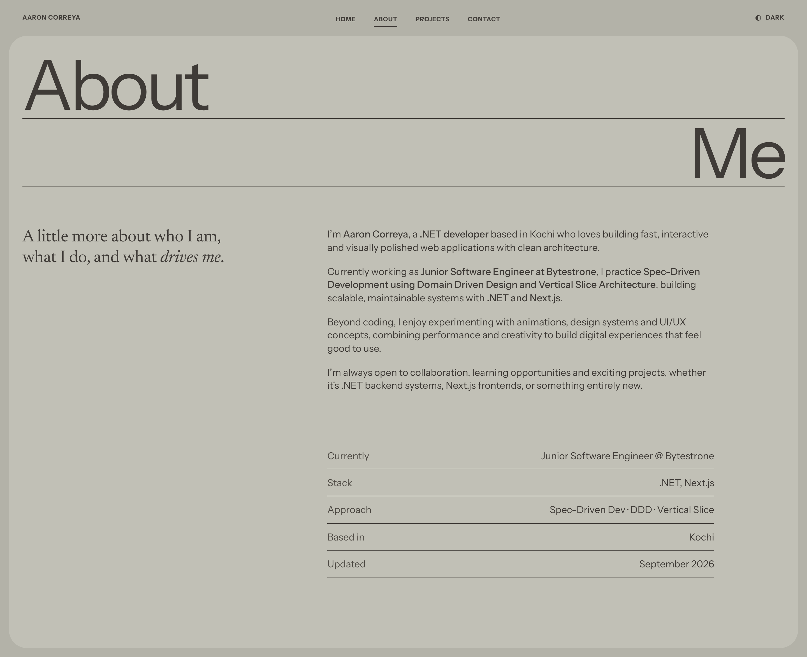</td>
    <td width="50%">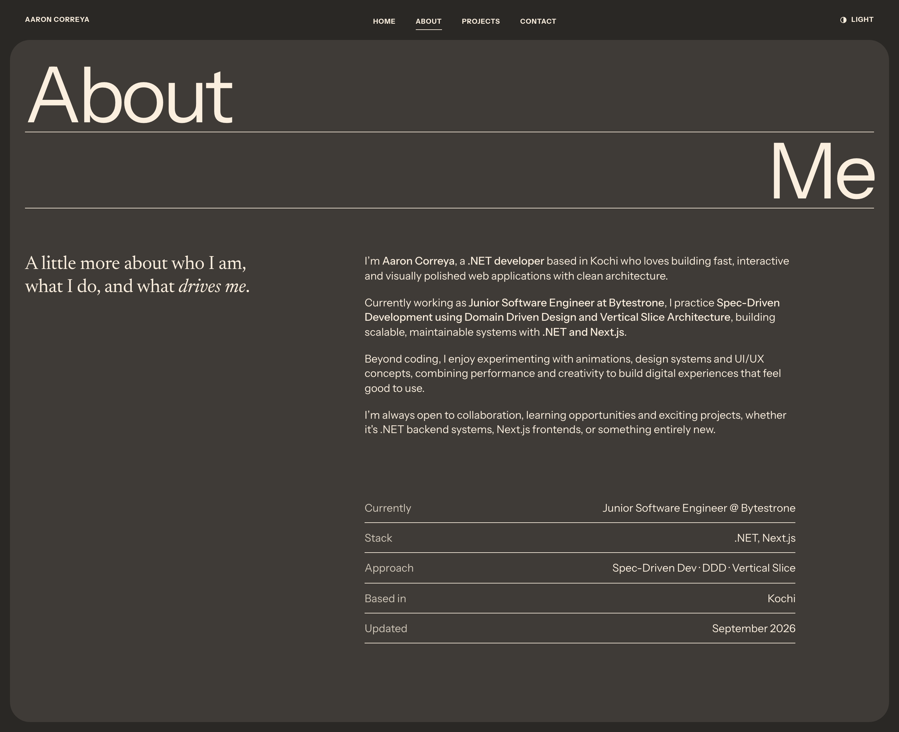</td>
  </tr>
  <tr>
    <td align="center"><sub><code>/about</code> · stone sheet, ink type</sub></td>
    <td align="center"><sub><code>/about</code> · ink sheet, cream type</sub></td>
  </tr>
</table>

**The inverted moment.** The contact sheet is the one inverted route in the site (the mobile menu borrows the same `data-invert` trick). In light mode it drops an ink panel on the stone page; in dark mode it drops a cream panel on the charcoal page. Same component, one `invert` prop.

<table>
  <tr>
    <td width="50%">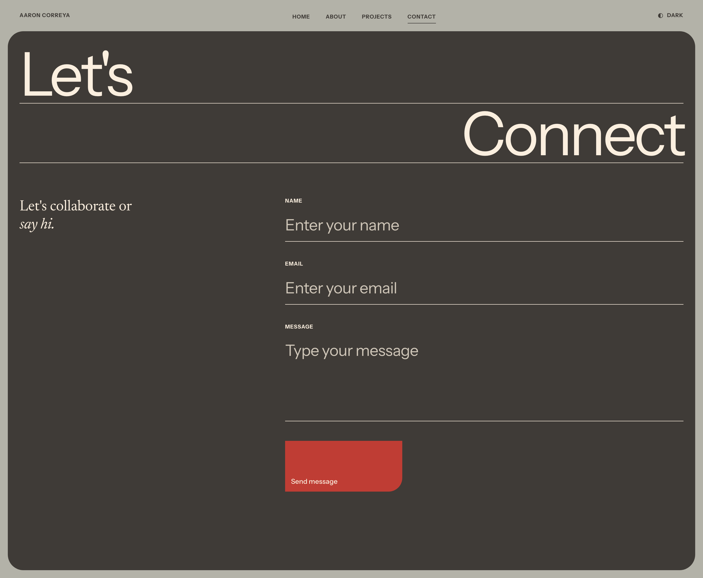</td>
    <td width="50%">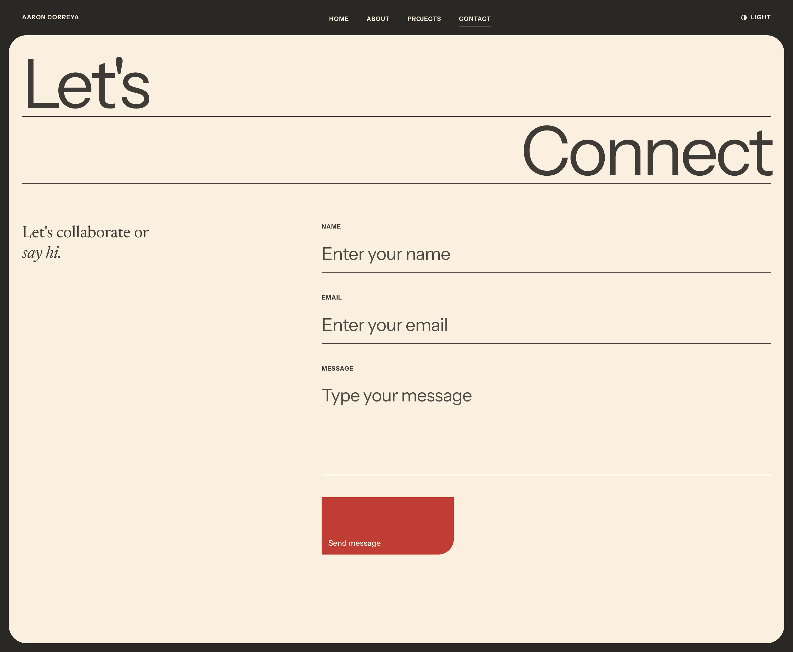</td>
  </tr>
  <tr>
    <td align="center"><sub><code>/contact</code> · light theme → ink sheet</sub></td>
    <td align="center"><sub><code>/contact</code> · dark theme → cream sheet</sub></td>
  </tr>
</table>

> [!NOTE]
> **Zero-flash theme engine.** An inline script in `index.html` reads `localStorage.theme`, falls back to `prefers-color-scheme`, and sets `data-theme` on `<html>` before first paint. Components never touch raw colours: they use semantic tokens that are re-mapped once for dark mode and once more for `[data-invert]`, and Tailwind v4 reads them through an `@theme inline` block.

| Token | Light | Dark |
|---|---|---|
| `--page` | `#b3b2a8` stone-deep | `#2a2825` charcoal |
| `--panel` | `#c1c0b6` stone | `#3f3b37` ink |
| `--fg` | `#3f3b37` ink | `#fbefdf` cream |
| `--accent` | `#bf3d34` brick | `#e7aa2c` ochre |
| Tiles | cream · brick · ochre | unchanged |

<br />

## Scene 03 — Editorial Typography & Dynamic Motion

<table>
  <tr>
    <td width="75%">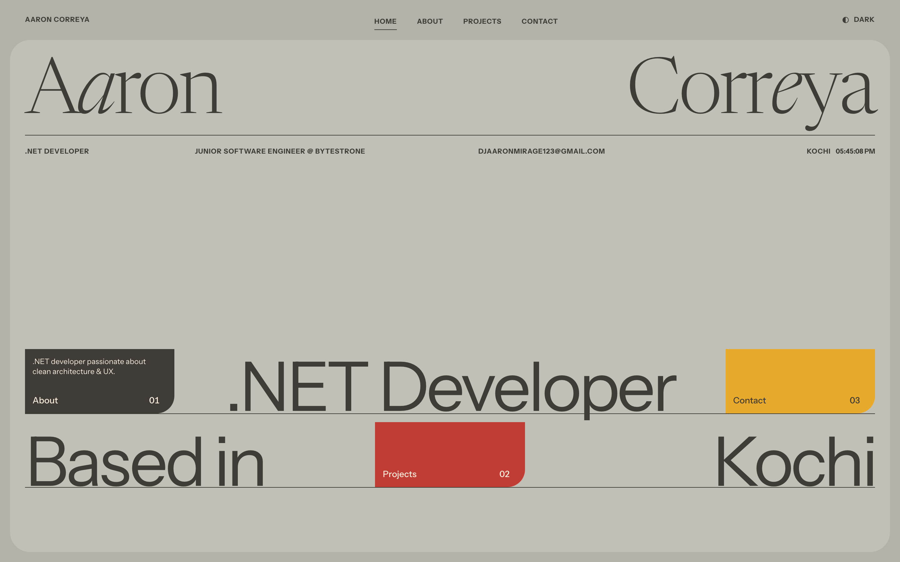</td>
    <td width="25%">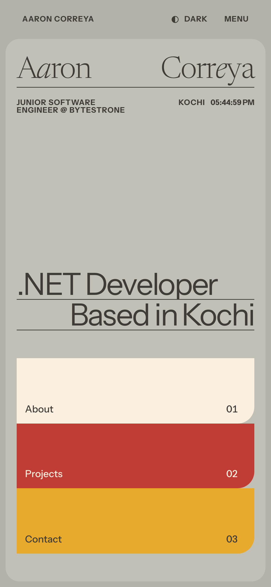</td>
  </tr>
  <tr>
    <td align="center"><sub>Nav tile hover: ink wipe from the bottom, description fades in</sub></td>
    <td align="center"><sub>Phone width: same type scale, stacked tiles</sub></td>
  </tr>
</table>

- **Two faces, one voice.** *Newsreader* (variable serif, weight 300) carries the name and ledes with single italic letters: A*a*ron, Corr*e*ya. *Instrument Sans* sets the two-line display statements, each pinned left or right under a hairline rule that draws itself in.
- **Split-letter reveals.** Headlines split into words, then characters, and rise out of a mask with a 0.02 s stagger. A screen-reader copy stays in plain text, and kerning is re-measured after fonts load.
- **Fluid scale.** One `clamp()` lands the display size on 124 px at 1440 wide and never below 44 px.
- **Live clock.** The meta strip pairs the label *Kochi* with a ticking clock in tabular numerals, updated every second, shown in the visitor's local time.
- **Hover as choreography.** Tiles rise on entry; on hover an ink wipe scales up from the bottom and the one-line description fades in. Hover effects only run on devices that can hover.
- **Respectful by default.** Motion-driven page components read `useReducedMotion()` and degrade to opacity fades; the hover and reveal CSS transitions collapse under `prefers-reduced-motion`.

<details>
<summary><b>Motion and type constants</b></summary>
<br />

| Constant | Value |
|---|---|
| `EASE` | `[0.215, 0.61, 0.355, 1]` (mirrors CSS `--ease-out`) |
| `EASE_INOUT` | `[0.645, 0.045, 0.355, 1]` (mirrors CSS `--ease-inout`) |
| `DUR` | `char 0.8 · rule 0.9 · card 0.7 · sheetIn 0.6 · sheetOut 0.32 · fade 0.5` |
| `STAGGER` | `char 0.02 · word 0.06 · card 0.1 · item 0.08` |
| Character reveal | `y 118% → 0%` over `DUR.char`, parent `staggerChildren: STAGGER.char` |
| Nav tile hover | `::before` wipe `scaleY 0 → 1`, origin bottom, 0.6 s; description delay 0.18 s |
| `--fs-display` | `clamp(2.75rem, 8.6vw, 7.75rem)`, line-height 0.76 |
| Tracking | serif `−0.03em` · sans `−0.045em` |
| Theme cross-fade | `html.theme-switching` for 720 ms, colour properties only |

</details>

<br />

## Scene 04 — Interactive Project Gallery

<table>
  <tr>
    <td width="50%">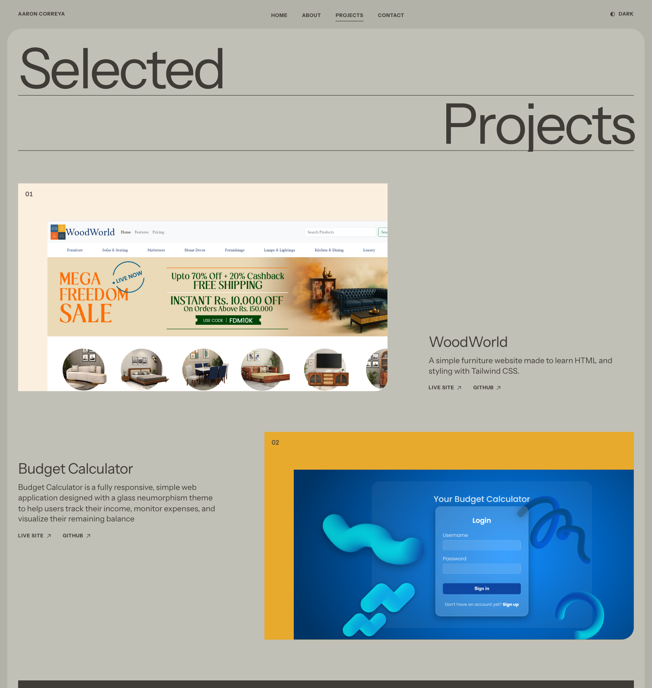</td>
    <td width="50%">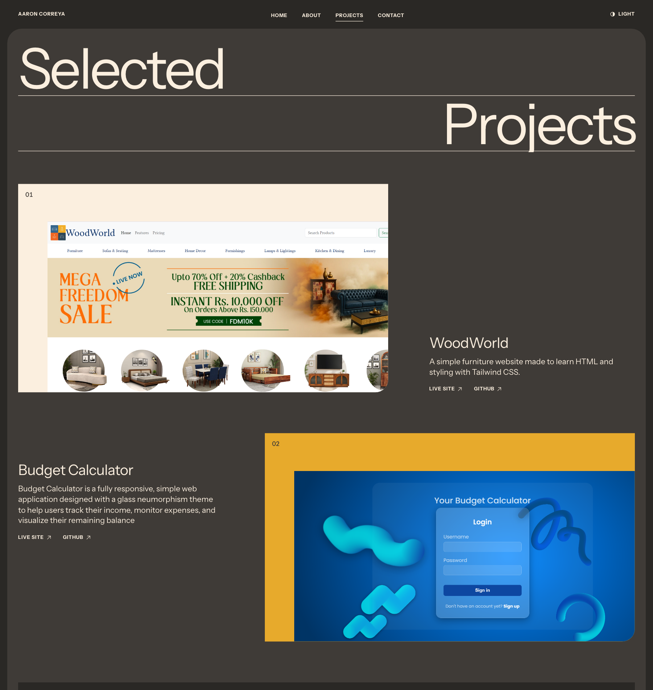</td>
  </tr>
  <tr>
    <td align="center"><sub><code>/projects</code> · light</sub></td>
    <td align="center"><sub><code>/projects</code> · dark</sub></td>
  </tr>
</table>

<div align="center">
  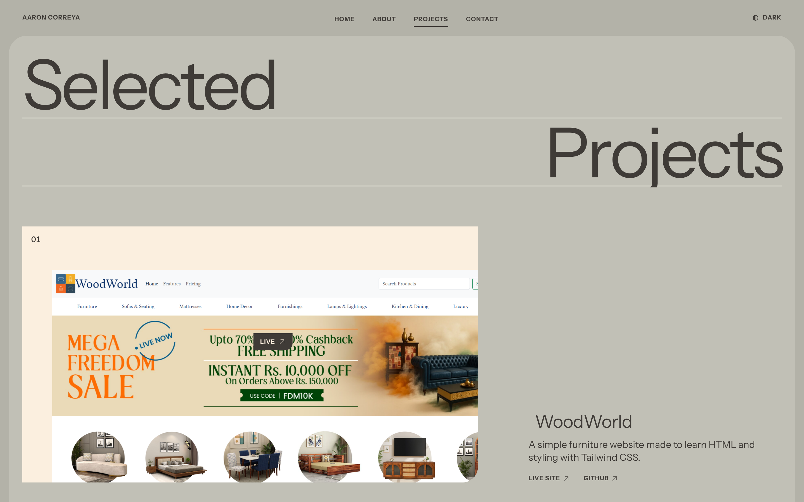
  <br /><sub>Hover a tile and a cursor-following <b>LIVE</b> pill appears, driven by spring motion values</sub>
</div>

<br />

Five tiles on a 15-column grid, each with its own tone (cream, ochre, ink, brick, cream) and layout kind (split, wide, half). Screenshots reveal through an animated `clip-path` inset; the first image loads eagerly, the rest lazily. Each tile opens the live site, and its caption carries the Live site and GitHub links.

| # | Project | Live | Repo |
|---|---|---|---|
| 01 | **WoodWorld** · HTML, Tailwind | [netlify](https://aaron-furniture-website.netlify.app/) | — |
| 02 | **Budget Calculator** · glass-neumorphic tracker | [netlify](https://aaron-budget-calculator.netlify.app/) | — |
| 03 | **BMI Calculator** · front-end health classifier | [netlify](https://aaronbmicalculator.netlify.app/) | — |
| 04 | **Simple Bank App** · vanilla JS, sessionStorage | [github.io](https://aaronstark1.github.io/ourbank-website/) | [ourbank-website](https://github.com/AaronStark1/ourbank-website) |
| 05 | **Gotta Match 'Em All** · React, NES.css, PokéAPI | [netlify](https://pokemon-gotta-match-em-all.netlify.app/) | [gotta-match-em-all](https://github.com/AaronStark1/gotta-match-em-all) |

<sub>TODO: repos for 01–03 are placeholders in `src/data/projects.js`.</sub>

<details>
<summary><b>Full-page captures</b></summary>
<br />
<table>
  <tr>
    <td width="50%">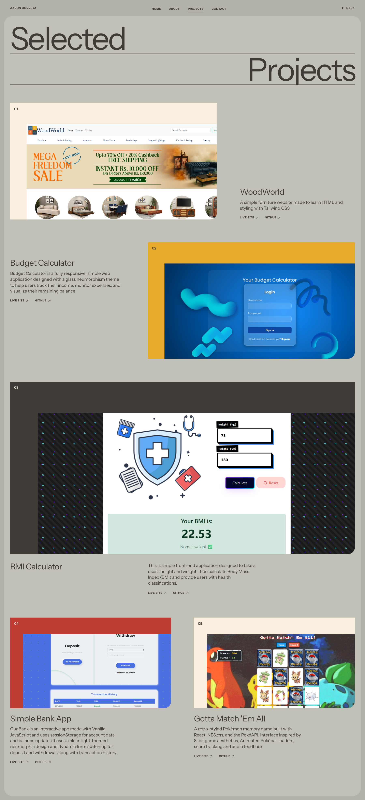</td>
    <td width="50%">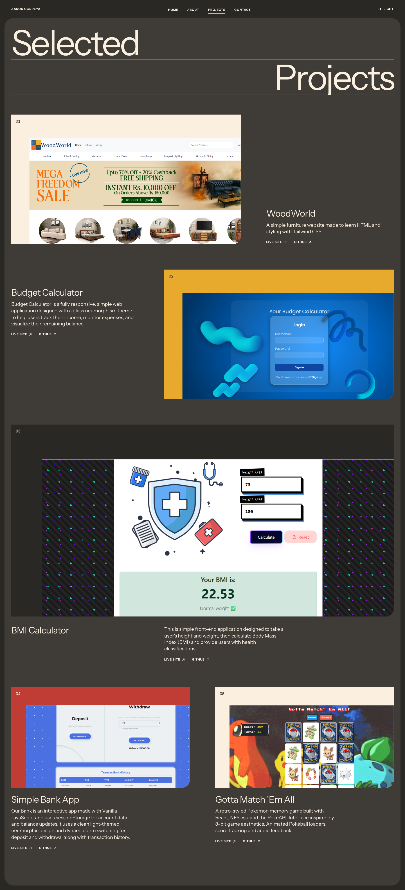</td>
  </tr>
</table>
</details>

<br />

## Engineering Core & Philosophy

Aaron is a **Junior Software Engineer at Bytestrone**, working in .NET with **Spec-Driven Development**, **Domain-Driven Design** and **Vertical Slice Architecture**. Two habits from that work shape this frontend:

- **One source of truth for constants.** Easing curves, core durations and staggers live in `src/lib/motion.js`; every colour lives in the token block of `src/index.css`. Components read tokens and never use raw colours.
- **Small, self-contained pages.** Each route composes `Sheet` and the `TitleLines` system, reaching for `NavCard` where it needs a tile. Adding a page touches one file plus the router.

The contact form is a single client-side `fetch` to Web3Forms with field validation and a 3-second client rate limit.

<br />

## Interactive Specs & Quickstart

| Layer | Choice |
|---|---|
| **Framework** | [React 19](https://react.dev/) · [Vite 7](https://vite.dev/) · [React Router 7](https://reactrouter.com/) |
| **Styling** | [Tailwind CSS v4](https://tailwindcss.com/) via `@tailwindcss/vite` · semantic CSS tokens · `@theme inline` |
| **Motion** | [Motion 13](https://motion.dev/) (`motion/react`), the only JS animation dependency · `AnimatePresence` · `useReducedMotion` |
| **Typography** | [Newsreader Variable](https://fontsource.org/fonts/newsreader) + [Instrument Sans Variable](https://fontsource.org/fonts/instrument-sans), self-hosted via Fontsource |
| **Icons** | [Phosphor Icons](https://phosphoricons.com/) |
| **APIs** | [Web3Forms](https://web3forms.com/) for the contact form |

### One-minute local setup

Everything except the contact form runs without any environment variables.

```bash
git clone https://github.com/AaronStark1/aaron-portfolio.git
cd aaron-portfolio
npm install
cp .env.example .env        # optional: only the contact form needs a Web3Forms key
npm run dev                 # http://localhost:5173
```

```env
# .env
VITE_WEB3FORMS_KEY=your_web3forms_access_key
```

| Command | Does |
|---|---|
| `npm run dev` | Vite dev server with HMR |
| `npm run build` | Production bundle to `dist/` |
| `npm run preview` | Serve the production bundle locally |
| `npm run lint` | ESLint (flat config, React Hooks + React Refresh) |

> [!TIP]
> **Deploying.** Any static host works (Vercel, Netlify, Cloudflare Pages). Build with `npm run build`, publish `dist/`, set `VITE_WEB3FORMS_KEY` in the dashboard, and add an SPA rewrite so every route falls back to `index.html`.

### Project blueprint

```text
aaron-portfolio/
├── index.html                  # anti-flash theme script, meta theme-color
├── src/
│   ├── App.jsx                 # Router + AnimatePresence(mode="wait") around the routes
│   ├── index.css               # Tailwind v4 import, palette, semantic tokens, type scale, 15-col grid, hover CSS
│   ├── lib/motion.js           # EASE / DUR / STAGGER, rise & fade variants, intro scale, fonts-ready hook
│   ├── components/
│   │   ├── Sheet.jsx           # the page sheet: enter/exit variants, `invert` prop, scroll reset
│   │   ├── TitleLines.jsx      # word → character split, mask reveal, hairline rule, kerning repair
│   │   ├── NavCard.jsx         # tonal tile (cream / ochre / brick / ink) as button, Link or anchor
│   │   ├── RevealLink.jsx      # CSS double-label slide link, NavLink-aware
│   │   ├── Navbar.jsx          # layoutId active underline, inverted mobile menu sheet
│   │   └── ThemeToggle.jsx     # half-filled dot that turns over
│   ├── context/                # ThemeContext + ThemeProvider (localStorage "theme")
│   ├── data/projects.js        # the five tiles: title, description, image, live, github
│   ├── pages/                  # Home · About · Projects · Contact · NotFound
│   └── styles/                 # projects.css (tile tones, hover, cursor pill) · notfound.css
├── public/projects/            # project1–5.png
└── .github/assets/             # the screenshots in this README
```

<br />

## Credits & End Roll

<div align="center">

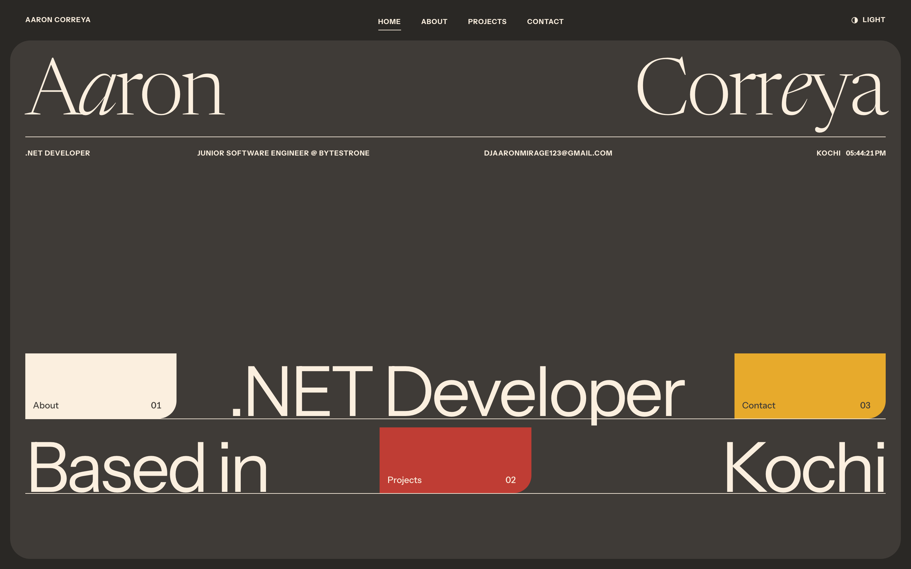

<br /><br />

**Aaron Correya**<br />
Junior Software Engineer · .NET & Full-Stack · Kochi, India

[](mailto:djaaronmirage123@gmail.com)
[](https://github.com/AaronStark1)
[](https://www.linkedin.com/in/aaron-correya/)
[](https://aaron-correya-portfolio.netlify.app/)

<sub>Typefaces: Newsreader & Instrument Sans · Design benchmark: editorial print layouts with hairline rules and tonal tiles</sub>

</div>
